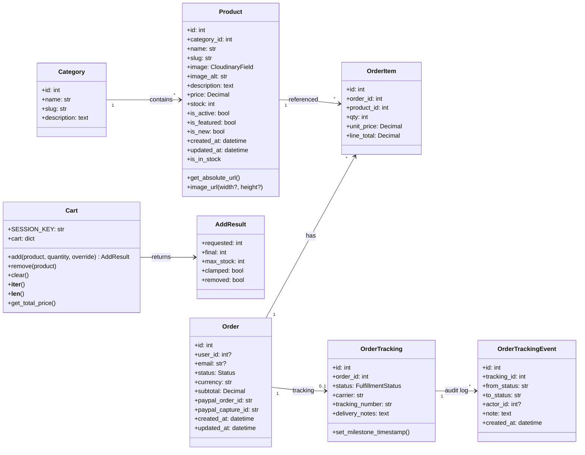
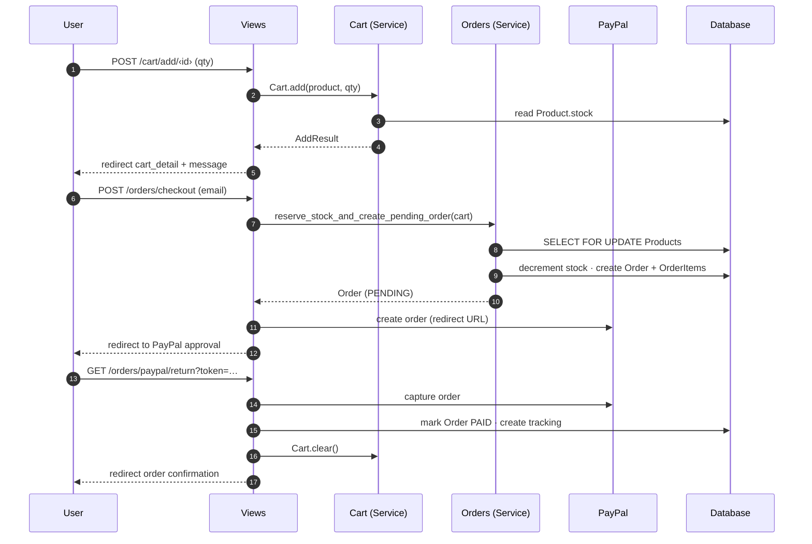

# le_shop

A modern, passwordless e-commerce application built on **Django 6.0**,
**HTMX**, and **Tailwind CSS v4**.

## Table of Contents

1. [Tech Stack](#tech-stack)
2. [Architecture](#architecture)
3. [Project Structure](#project-structure)
4. [Quick Start](#quick-start)
5. [Command Reference](#command-reference)
6. [Conventions](#conventions)
7. [Testing](#testing)

---

## Tech Stack

| Domain          | Technology                          |
| :-------------- | :---------------------------------- |
| **Runtime**     | Python 3.13 · Django 6.0 · DRF     |
| **Auth**        | django-allauth — passwordless MFA   |
| **Frontend**    | Tailwind CSS v4 (CSS-first) · HTMX · GSAP |
| **Payments**    | PayPal                              |
| **Media**       | Cloudinary                          |
| **Admin**       | django-unfold                       |
| **Database**    | SQLite (dev) · PostgreSQL (prod)    |
| **Security**    | django-csp · WhiteNoise             |
| **Quality**     | Ruff · mypy · pytest · Playwright   |
| **Bundler**     | Bun                                 |

[↑ Top](#table-of-contents)

---

## Architecture

This project uses a **service + selector** architecture on top of Django's
standard app layout.

### Layer Responsibilities

| Layer              | File              | Rules |
| :----------------- | :---------------- | :---- |
| **Models**         | `models.py`       | Data and field definitions only. Minimal helpers (`__str__`, `get_absolute_url`). |
| **Selectors**      | `selectors.py`    | Read-only query composition. No side effects. |
| **Services**       | `services.py`     | Transactional write workflows. All DB writes use `transaction.atomic()`. |
| **Views**          | `views.py`        | HTTP orchestration — calls services/selectors, picks templates, sets messages. |
| **Context Processors** | `context_processors.py` | Injects global template context (e.g. cart count). |
| **Constants**      | `constants.py`    | Choices, magic numbers, config values. |

### Class Diagram



### Checkout Flow



[↑ Top](#table-of-contents)

---

## Project Structure

```text
le_shop/
├── backend/
│   ├── apps/
│   │   ├── accounts/      # User settings, email change, danger zone
│   │   ├── cart/           # Session cart, add/remove/clear
│   │   ├── core/           # Site-wide models, allauth form overrides
│   │   ├── orders/         # Checkout, PayPal, tracking, fulfilment
│   │   └── products/       # Catalogue, categories, selectors
│   ├── config/             # settings, urls, asgi, wsgi
│   ├── static/             # Compiled assets (CSS, JS, fonts)
│   ├── templates/          # Shared: base, partials, allauth overrides
│   │   ├── account/        # Allauth template overrides
│   │   ├── pages/          # Standalone pages (home, about)
│   │   └── partials/       # Reusable fragments (_navbar, _footer, …)
│   └── tests/
│       └── e2e/            # Playwright end-to-end tests
├── frontend/
│   └── src/app.css         # Tailwind source (CSS-first config)
├── manage.py
├── package.json
├── pyproject.toml
├── pytest.ini
└── run.ps1
```

> **Note:** `manage.py` lives at the root but points to
> `backend.config.settings`.

[↑ Top](#table-of-contents)

---

## Quick Start

### Prerequisites

- Python 3.12+
- Bun (latest)

### Installation

```powershell
# 1. Create & activate venv
python -m venv venv
.\venv\Scripts\Activate.ps1

# 2. Install Python dependencies (editable)
pip install -e ".[dev]"

# 3. Install frontend dependencies
bun install

# 4. Set up environment
copy .env.example .env   # then fill in values

# 5. Initialise database
python manage.py migrate

# 6. Create superuser
python manage.py createsuperuser
```

### Development Server

```powershell
.\run.ps1
```

Starts Django at `127.0.0.1:8000` and the Tailwind watcher in parallel.

[↑ Top](#table-of-contents)

---

## Command Reference

| Action            | Command                                  |
| :---------------- | :--------------------------------------- |
| **Dev server**    | `.\run.ps1`                              |
| **Unit tests**    | `pytest -x --ignore=backend/tests/e2e`   |
| **E2E tests**     | `pytest backend/tests/e2e -x --headed`   |
| **Lint**          | `ruff check .`                           |
| **Format**        | `ruff format .`                          |
| **Type check**    | `mypy .`                                 |
| **Build CSS**     | `bun run build`                          |
| **Migrations**    | `python manage.py makemigrations && python manage.py migrate` |

[↑ Top](#table-of-contents)

---

## Conventions

### Files & Naming

| Target           | Convention             | Example                          |
| :--------------- | :--------------------- | :------------------------------- |
| Python files     | `snake_case.py`        | `tracking_service.py`            |
| JS / CSS files   | `kebab-case`           | `hero-carousel.js`               |
| Classes          | `PascalCase`           | `OrderTracking`                  |
| Functions        | `snake_case`           | `get_active_products()`          |
| Constants        | `UPPER_SNAKE_CASE`     | `SESSION_KEY`                    |
| URL names        | `app:action-noun`      | `orders:order-track`             |
| Test files       | `test_<module>.py`     | `test_services.py`               |

### Templates

| Type                        | Location                                   | Naming                     |
| :-------------------------- | :----------------------------------------- | :------------------------- |
| App page                    | `apps/<app>/templates/<app>/`              | `noun_action.html`         |
| HTMX fragment               | `apps/<app>/templates/<app>/`              | `_noun_fragment.html`      |
| Shared partial               | `templates/partials/`                      | `_noun.html`               |
| Standalone page              | `templates/pages/`                         | `noun.html`                |
| Allauth override             | `templates/account/`                       | (match allauth names)      |

> Partials and fragments are always prefixed with `_` to signal they are
> never rendered standalone.

### URL Namespacing

Always use namespaced URLs in templates and `reverse()` calls:

```django



```

### Database Writes

All write operations must use `transaction.atomic()` and live in
`services.py`, never in views.

[↑ Top](#table-of-contents)

---

## Testing

### Unit Tests (pytest + factory_boy)

```powershell
pytest -x --ignore=backend/tests/e2e
```

Each app has a `tests/` package with:

- `test_models.py` — model logic and constraints
- `test_services.py` — business logic (mocked DB where possible)
- `test_views.py` — request/response, status codes, redirects
- `conftest.py` / `factories.py` — shared fixtures and factories

### End-to-End Tests (Playwright)

```powershell
pytest backend/tests/e2e -x --headed
```

E2E tests cover full user journeys: auth flow, browse → cart → checkout,
UI/accessibility.

[↑ Top](#table-of-contents)